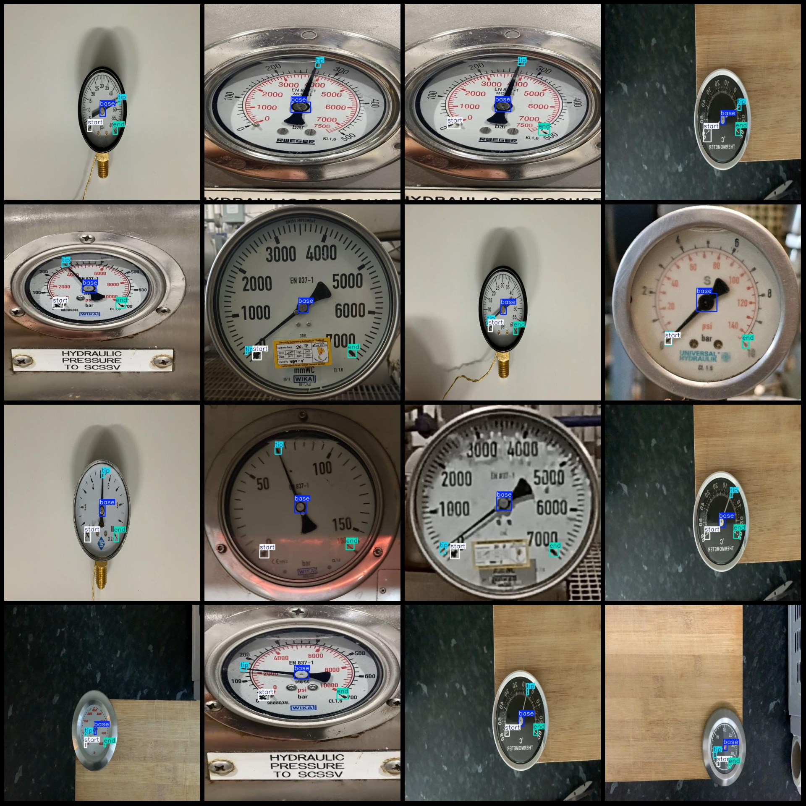
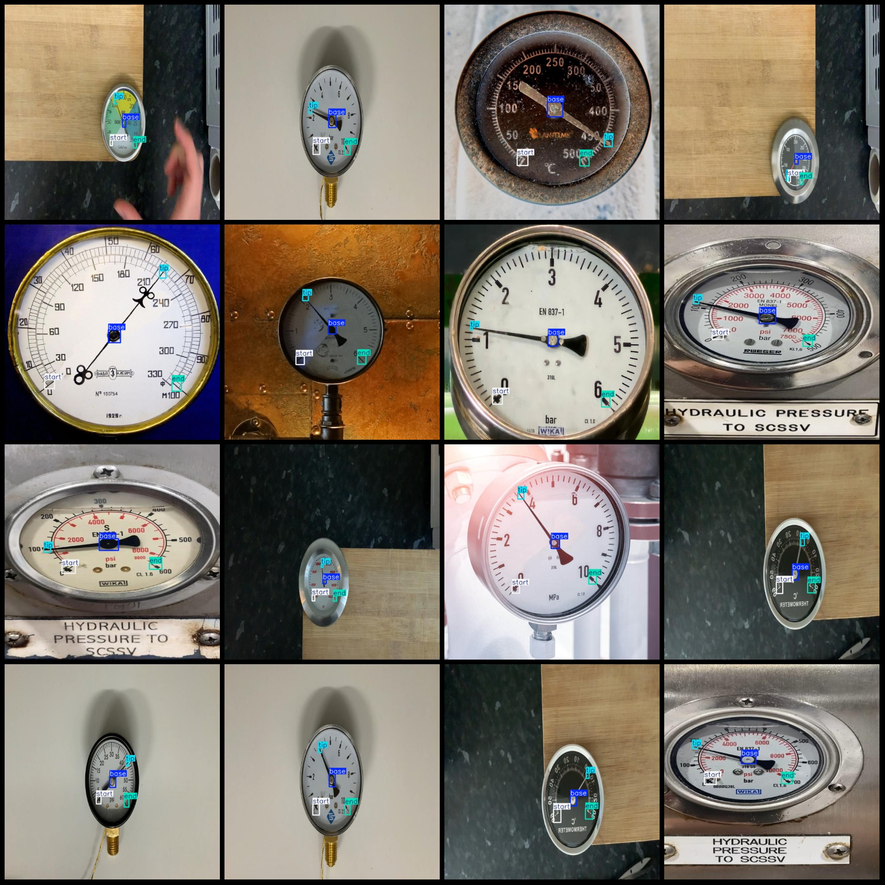

# Power Scene Circle Meter Reading Data Set - VOC+YOLO Format - 7698 Images in 4 Categories

Dataset Format: Pascal VOC format + YOLO format (txt file without split path, only containing jpg images along with their corresponding VOC format xml files and YOLO format txt files)
Number of Images: 7698
Number of Annotations (xml files): 7698
Number of Annotations (txt files): 7698
Number of Annotation Categories: 4
Label names in the annotation categories (note that the order in YOLO format does not correspond to this, but is in accordance with the labels folder's classes.txt): ["base", "end", "start", "tip"]
Number of bounding boxes per category:
base = 7670
end = 7513
start = 7534
tip = 7683
Total bounding box count: 30400
Number of images each category occupies:
base = 7662
end = 7495
start = 7512
tip = 7673
Image resolution: 640x640
Annotation tool used: labelImg
Annotation rules: draw square bounding boxes for the categories
Important Notice: The dataset does not have been divided into training/validation/test sets; it requires manual division.
Special Remark: This dataset does not guarantee the accuracy of the trained models or weight files.
Image Preview:
Annotation example:

## Images

Here is a pay link on Stripe ( https://buy.stripe.com/3cs8yP7sY87d0vu9AB ). Please contact me lonlonago@foxmail.com after funding $89, and I will send you a complete data files , thank you!

